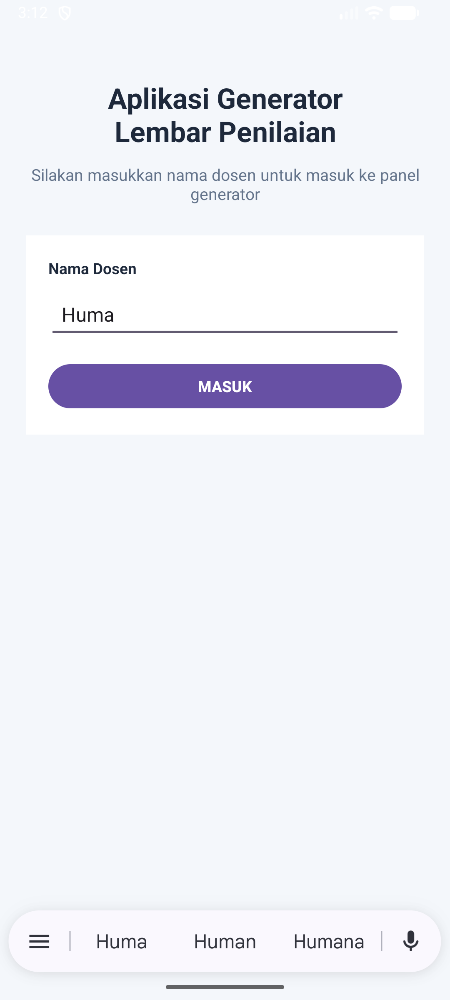
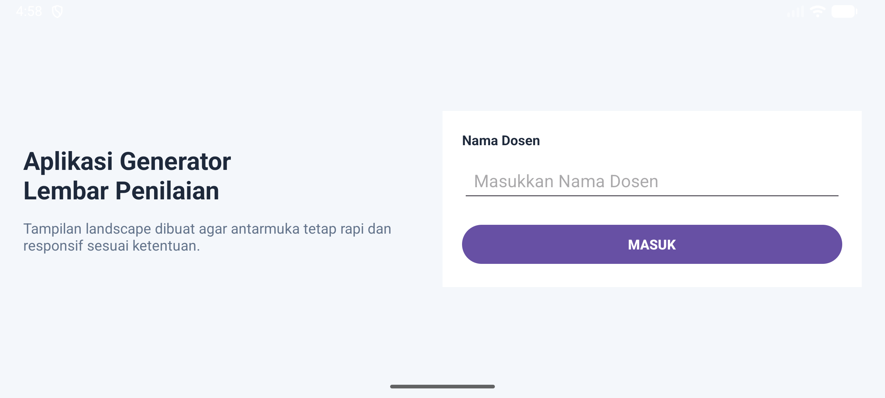
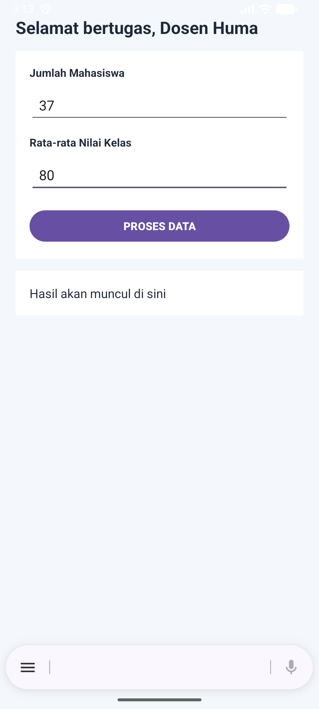
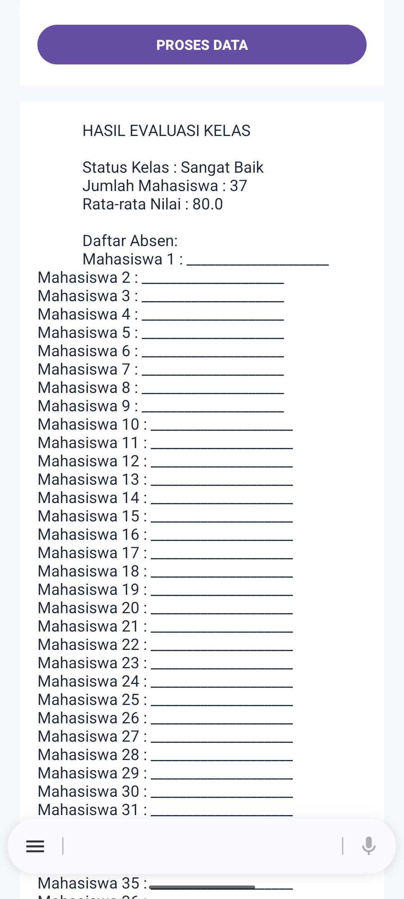

# UTS Pemrograman Seluler - Aplikasi Generator Lembar Penilaian

## Identitas Mahasiswa
- **Nama Lengkap:** Yunima Dioranda Manik
- **NIM:** 42430030
- **Program Studi:** Teknologi Informasi

## Deskripsi Aplikasi
Aplikasi ini dibangun untuk memenuhi Ujian Tengah Semester (UTS) mata kuliah Pemrograman Seluler. Aplikasi ini mendemonstrasikan penguasaan materi paruh pertama semester, meliputi:
1. **Modul 2 & 3:** Desain UI/UX dan penerapan Layout Responsif (beradaptasi saat *Portrait* dan *Landscape* menggunakan folder `layout-land`).
2. **Modul 4:** Navigasi multi-layar dan *Data Passing* menggunakan `Intent` (Mengirim data input dosen ke halaman panel).
3. **Modul 5:** Implementasi *Control Flow*:
    - Menggunakan percabangan `If-Else` untuk menentukan status kelas.
    - Menggunakan perulangan `For Loop` untuk mencetak daftar absen/lembar penilaian secara otomatis.

## Screenshot Aplikasi

### 1. Halaman Login (Responsif)
|                  Mode Portrait                   |                   Mode Landscape                    |
|:------------------------------------------------:|:---------------------------------------------------:|
|  |  |

### 2. Halaman Panel Generator
|                       Input Data                        |              Hasil Generate (If-Else & Loop)              |
|:-------------------------------------------------------:|:---------------------------------------------------------:|
|  |  |

## Fitur Aplikasi
- Input nama dosen pada halaman login
- Navigasi ke halaman panel generator menggunakan `Intent`
- Menampilkan sapaan: **Selamat bertugas, Dosen [Nama]**
- Input jumlah mahasiswa
- Input rata-rata nilai kelas
- Penentuan status kelas:
    - **>= 80** : Sangat Baik
    - **>= 60** : Cukup
    - **< 60** : Kurang
- Pembuatan daftar absen otomatis dengan `For Loop`
- Tampilan responsif untuk mode portrait dan landscape

## Teknologi yang Digunakan
- **Bahasa Pemrograman:** Kotlin
- **IDE:** Android Studio
- **UI Layout:** XML
- **Navigation & Data Passing:** Intent

## Struktur Project
```text
UTS_PemrogSeluler_42430030_Nima
├── app
├── gradle
├── screenshots
├── .gitignore
├── build.gradle.kts
├── gradle.properties
├── gradlew
├── gradlew.bat
└── settings.gradle.kts